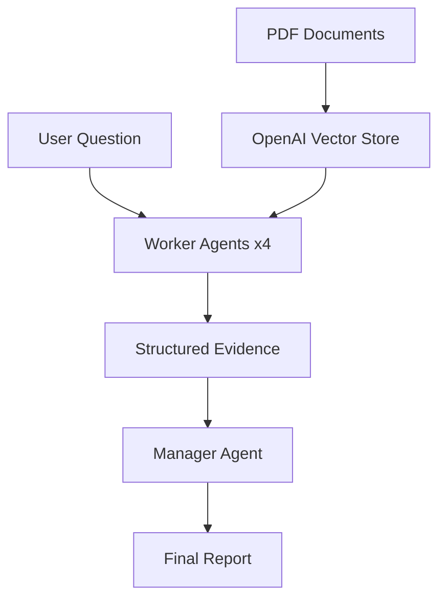

# Investigative AI Prototype

A comprehensive investigative AI system that ingests documents into OpenAI Vector Store and uses a Chain-of-Agents pattern to generate detailed investigative reports with evidence analysis, timelines, and conflict detection.

## Features

### 🔍 **Investigative Analysis**
- **Multi-Agent Analysis**: 4 parallel worker agents for comprehensive evidence extraction
- **Structured Evidence Extraction**: JSON schemas ensure consistent data extraction
- **Conflict Detection**: Explicit handling of contradictions and uncertainties
- **Source Attribution**: Maintains evidence traceability throughout analysis

### 🌐 **ChatGPT-Style Web Interface**
- **Modern UI**: Clean, responsive ChatGPT-inspired design
- **Real-time Streaming**: Live responses with progress updates
- **Document Management**: Drag-and-drop upload with processing status
- **Conversation History**: Multi-turn investigations with full context
- **Export Capabilities**: Download reports and conversation transcripts

### 📚 **Document Processing**
- **Smart Ingestion**: Automatic PDF chunking and embedding via OpenAI
- **OCR Support**: Automatic text extraction from scanned PDFs using Tesseract
- **Vector Search**: Semantic + keyword search capabilities  
- **Bulk Upload**: Process multiple documents simultaneously
- **Status Tracking**: Real-time indexing progress monitoring

### ⚡ **Dual Interface Options**
- **Web Interface**: Interactive ChatGPT-style experience (recommended)
- **Command-Line Scripts**: Automation-friendly workflow scripts

## Quick Start

### Prerequisites
- Python 3.10+ 
- OpenAI API key
- Tesseract OCR (for scanned PDFs)
- Poppler (for PDF rendering)

### Installation

1. **Install system dependencies (for OCR support):**
```bash
# macOS
brew install tesseract poppler

# Ubuntu/Debian
sudo apt-get install tesseract-ocr poppler-utils

# Windows - Download from:
# Tesseract: https://github.com/UB-Mannheim/tesseract/wiki
# Poppler: https://github.com/oschwartz10612/poppler-windows/releases
```

2. **Clone and setup the environment:**
```bash
# Create virtual environment
python -m venv .venv
source .venv/bin/activate  # On Windows: .venv\Scripts\activate

# Install dependencies
pip install -r requirements.txt
```

3. **Configure OpenAI API:**
```bash
# Copy the environment template
cp env-template.txt .env

# Edit .env and add your OpenAI API key:
OPENAI_API_KEY=your_key_here
```

4. **Start the web interface:**
```bash
python -m uvicorn web.app:app --reload
```

5. **Open in browser:**
Navigate to `http://localhost:8000`

## Usage

### 🌐 Web Interface (Recommended)

1. **Upload Documents**
   - Drag and drop PDFs into the upload area
   - Monitor upload and indexing progress
   - View document status in the sidebar

2. **Start Investigation**
   - Type questions in the ChatGPT-style chat interface
   - Watch real-time progress as agents analyze evidence
   - Review comprehensive reports with timelines and findings

3. **Export Results**
   - Download conversation transcripts
   - Save investigation reports as Markdown

### 💻 Command-Line Workflow

For automation and scripting:

```bash
# 1. Create vector store
python scripts/00_create_store.py

# 2. Upload documents from data/docs/ folder
python scripts/01_upload_docs.py

# 3. Ask quick questions
python scripts/02_ask.py "What are the key events and timeline?"

# 4. Generate comprehensive CoA report
python scripts/03_coa_report.py "Analyze this case: timeline, conflicts, gaps"

# 5. Clean up when done
python scripts/99_cleanup.py
```

## Architecture

### Chain-of-Agents Pattern



1. **Worker Agents** (4 parallel): Extract structured evidence from documents
2. **Manager Agent**: Synthesizes worker outputs into comprehensive reports

### Report Structure

Each investigation generates:
- **Executive Summary** (5-10 key points)
- **Timeline** (chronological events)  
- **Key Findings** (evidence-based conclusions)
- **Conflicts/Uncertainties** (contradictions identified)
- **Gaps & Next Questions** (areas needing investigation)

## Project Structure

```
investigative-ai-proto/
├── data/docs/              # PDF/document storage
├── prompts/                # Agent prompt templates  
│   ├── worker.md          # Worker agent instructions
│   └── manager.md         # Manager agent instructions
├── src/                    # Core Python modules
│   ├── config.py          # Environment configuration
│   ├── state.py           # State management
│   ├── ingest.py          # Document ingestion
│   ├── ask.py             # Query interface
│   └── coa.py             # Chain-of-agents engine
├── scripts/                # Command-line workflow
│   ├── 00_create_store.py # Initialize vector store
│   ├── 01_upload_docs.py  # Upload documents
│   ├── 02_ask.py          # Quick queries
│   ├── 03_coa_report.py   # Generate reports
│   └── 99_cleanup.py      # Cleanup resources
├── web/                    # ChatGPT-style interface
│   ├── app.py             # FastAPI web server
│   ├── websocket.py       # Real-time communication
│   ├── templates/         # HTML templates
│   └── static/            # CSS, JavaScript, assets
├── requirements.txt        # Python dependencies
├── env-template.txt       # Environment setup guide
└── README.md              # This file
```

## API Documentation

### REST Endpoints

- `GET /` - Web interface
- `GET /api/status` - System and vector store status
- `POST /api/create-vector-store` - Initialize vector store
- `POST /api/upload` - Upload documents (multipart/form-data, auto-OCR for scanned PDFs)
- `GET /api/documents` - List uploaded documents  
- `DELETE /api/documents/{id}` - Remove document
- `POST /api/ask` - Ask question (JSON: `{"question": "..."}`)
- `POST /api/reextract/{filename}` - Re-extract document with OCR
- `GET /api/extraction` - Get extraction status and summary
- `GET /api/extraction/entities` - Get all extracted entities
- `GET /api/extraction/conflicts` - Get detected conflicts

### WebSocket Events

- **Client → Server**: `{"type": "question", "content": "..."}`
- **Server → Client**: 
  - `{"type": "status", "content": "..."}`
  - `{"type": "progress", "content": "...", "progress": 0.5}`
  - `{"type": "response", "content": "...", "question": "..."}`
  - `{"type": "error", "content": "..."}`

## Configuration

### Environment Variables

```bash
# Required
OPENAI_API_KEY=your_openai_api_key

# Optional
OPENAI_MODEL=gpt-4o-mini          # Default model
OPENAI_PROJECT=your_project_id    # OpenAI project ID
```

### Agent Prompts

Customize investigation behavior by editing:
- `prompts/worker.md` - Evidence extraction instructions
- `prompts/manager.md` - Report synthesis instructions

## Examples

### Investigation Questions

**Timeline Analysis:**
> "Create a detailed timeline of all events mentioned in the documents, including dates, locations, and people involved."

**Conflict Detection:**  
> "Identify any contradictions, inconsistencies, or conflicting accounts between different documents."

**Entity Analysis:**
> "Who are the key people and organizations involved? What are their roles and relationships?"

**Gap Analysis:**
> "What important information is missing? What questions remain unanswered?"

### Sample Output

```markdown
# Investigation Report

## Executive Summary
- 15 documents analyzed spanning 2019-2023
- Key incident occurred on March 15, 2022
- 3 primary actors identified with conflicting accounts
- Timeline shows 2-week gap in documentation

## Timeline
**2022-03-01**: Initial meeting scheduled (Document A)
**2022-03-15**: Incident reported (Documents B, C) 
**2022-03-30**: Follow-up investigation (Document D)

## Key Findings
1. **Evidence Pattern**: Documents show clear sequence leading to incident
2. **Witness Accounts**: Multiple corroborating sources confirm timeline
3. **Documentation Gap**: Missing records for March 16-29 period

## Conflicts & Uncertainties
- **Time Discrepancy**: Document B states 3:00 PM, Document C states 3:30 PM
- **Location Conflict**: Building A vs Building B mentioned in different sources

## Next Questions
1. What happened during the missing 2-week period?
2. Can the time discrepancy be resolved with additional sources?
3. Are there security logs that could clarify the location?
```

## Development

### Running in Development

```bash
# Start with auto-reload
uvicorn web.app:app --reload --host 0.0.0.0 --port 8000

# Or run directly
python web/app.py
```

### Adding New Features

1. **Core Logic**: Add modules to `src/`
2. **Web API**: Extend `web/app.py` with new endpoints
3. **Frontend**: Update `web/static/` and `web/templates/`
4. **CLI**: Add scripts to `scripts/`

### Testing Documents

Place test PDFs in `data/docs/` and run:
```bash
python scripts/01_upload_docs.py
python scripts/02_ask.py "Summarize the key points"
```

## Troubleshooting

### Common Issues

**"No vector store found"**
- Solution: Upload documents first, which auto-creates the vector store

**WebSocket connection failed** 
- Check if the server is running on the correct port
- Verify firewall settings for local development

**Document upload stuck "Processing"**
- Wait for OpenAI indexing to complete (can take several minutes)
- Check API key permissions and rate limits

**Import errors when running scripts**
- Ensure you're in the project root directory
- Verify virtual environment is activated

**Scanned PDF not being indexed/searchable**
- Check console for "No text found... attempting OCR" message
- Verify Tesseract is installed: `tesseract --version`
- Verify Poppler is installed: `pdftoppm -v`
- On macOS: `brew install tesseract poppler`

**OCR extraction is slow**
- OCR can take 5-30 seconds per page depending on quality
- Progress is logged to console during upload

### Debug Mode

Enable detailed logging:
```bash
export PYTHONPATH=.
python -c "import logging; logging.basicConfig(level=logging.DEBUG)"
uvicorn web.app:app --log-level debug
```

## License

MIT License - feel free to modify and extend for your investigation needs.

## Contributing

This is a prototype - contributions welcome! Areas for enhancement:
- Additional document formats (Word, Excel, etc.)
- Advanced visualization features  
- Multi-language support
- Integration with external databases
- Enhanced security features

---

*Built with OpenAI's Vector Store and file_search capabilities for comprehensive document analysis and investigative reporting.*
